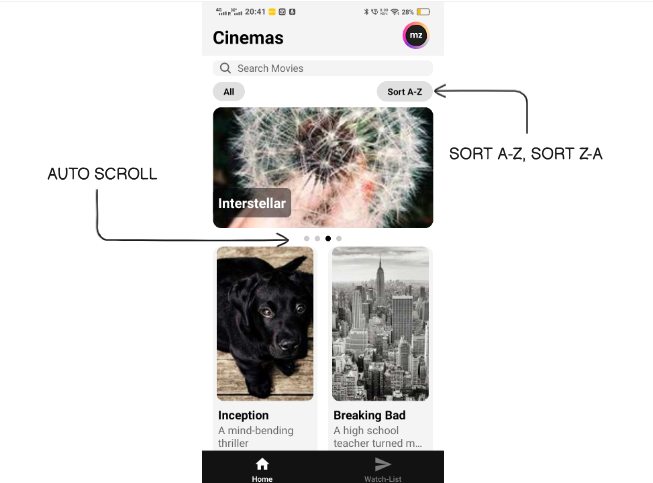
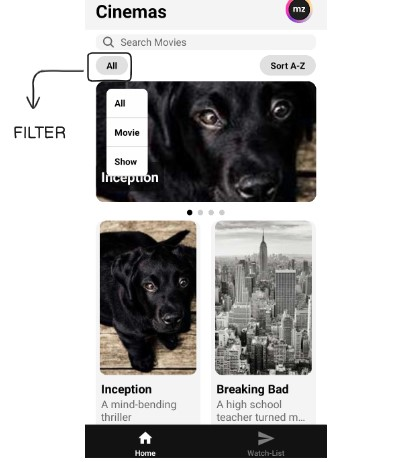
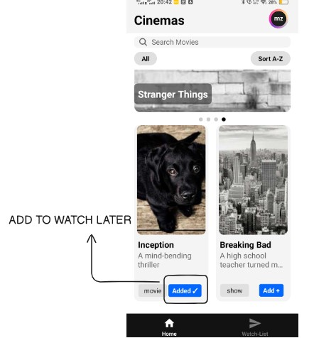
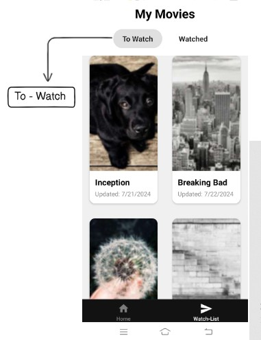
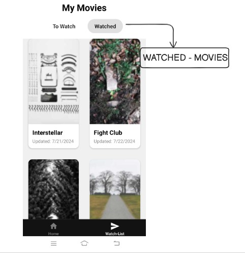
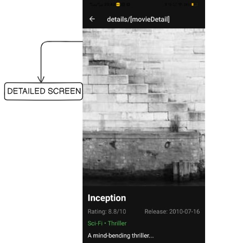
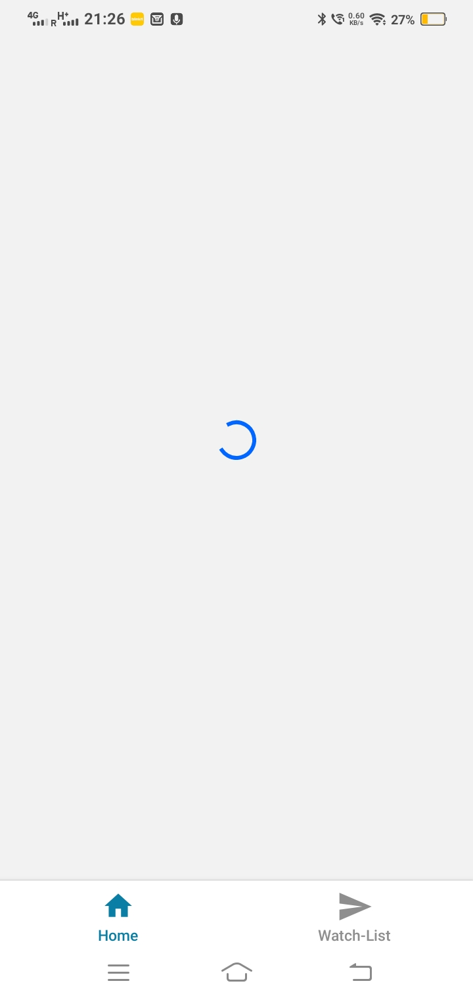

# React Native Cinema App

# Welcome to Cinema app 👋


## Overview
This is a React Native Cinema App designed to provide users with an engaging way to browse and manage movies and shows. The app includes a grid view, filtering, and sorting capabilities to ensure a seamless browsing experience. Users can also manage a "To Watch" and "Watched" list, search for titles, and view detailed information for each movie/show.

## Features

### 1. **Grid View**
Display movies and shows in a user-friendly grid layout.
### 2. **Sort Alphabetically**
Sort the list of movies and shows alphabetically for better organization.


---


---

### 3. **Filter by Movie/Show**
Toggle between viewing only movies or only shows, or view all items.


---

### 4. **Search Bar**
Search for movies and shows by their titles in real-time.

---

### 5. **'Add' Button**
Add movies or shows to a "To Watch" list for later viewing.


---

### 6. **To Watch/Watched Tab**
Manage your watchlist with separate tabs for "To Watch" and "Watched" items.



---

### 7. **Detailed Page**
Click on a movie or show to view a detailed page, including its description, cast, and more.


---

### 8. **Loader**
Show a loading spinner while data is being fetched from the API.


---

## Installation and Setup

### Prerequisites
Ensure you have the following installed:
- **Node.js**: [Download and install Node.js](https://nodejs.org/)
- **React Native CLI**: [Setup React Native environment](https://reactnative.dev/docs/environment-setup)

### Installation

1. Clone the repository:
   ```bash
   git clone https://github.com/zaidimurtaza/React-Native-Cinema-App.git
   cd React-Native-Cinema-App
